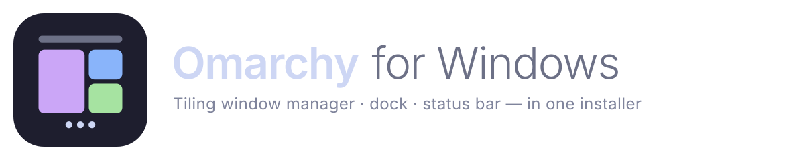
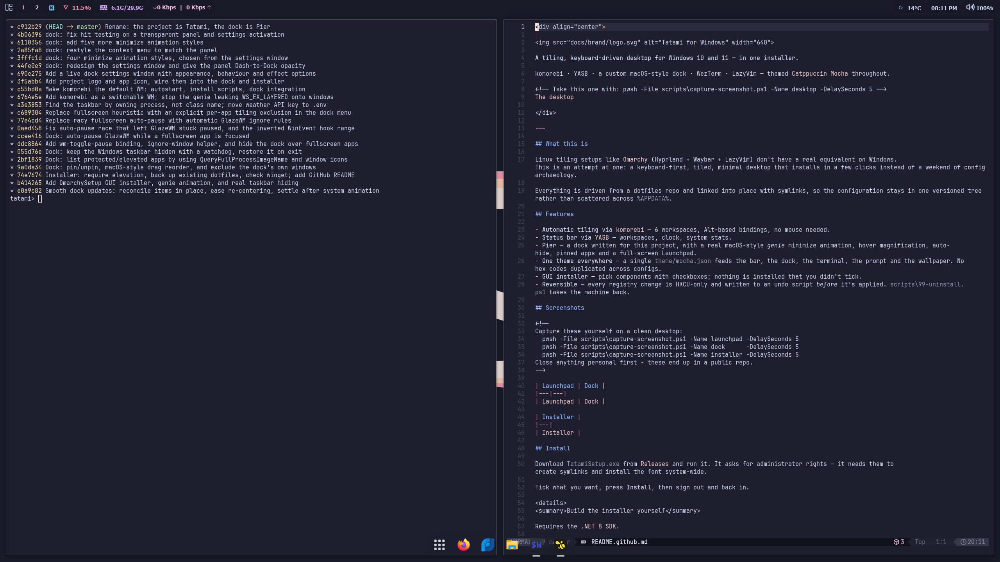
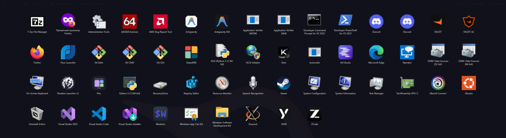
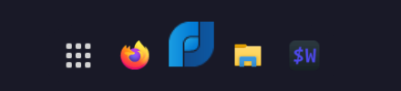
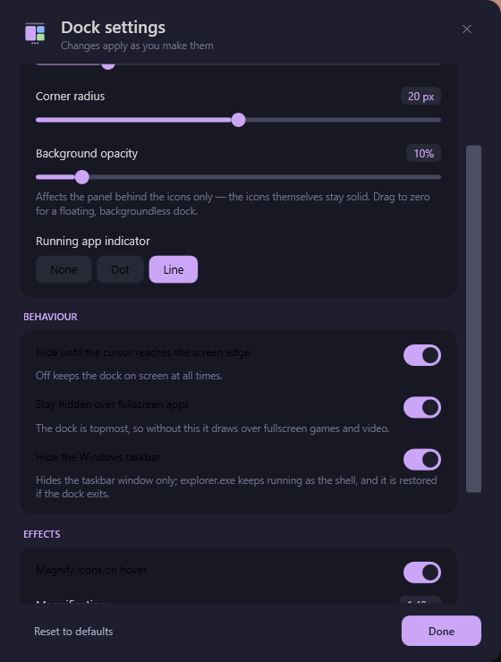
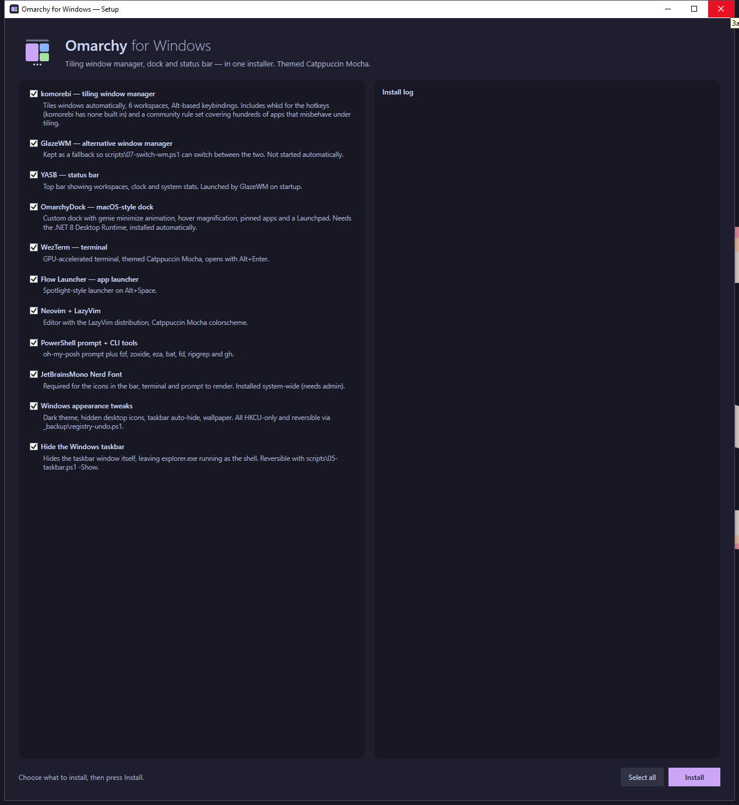

<div align="center">



**A tiling, keyboard-driven desktop for Windows 10 and 11 — in one installer.**

komorebi · YASB · a custom macOS-style dock · WezTerm · LazyVim — themed [Catppuccin Mocha](https://catppuccin.com/) throughout.

<!-- Take this one with: pwsh -File scripts\capture-screenshot.ps1 -Name desktop -DelaySeconds 5 -->


</div>

---

## What this is

Linux tiling setups like [Omarchy](https://omarchy.org/) (Hyprland + Waybar + LazyVim) don't have a real equivalent on Windows. This is an attempt at one: a keyboard-first, tiled, minimal desktop that installs in a few clicks instead of a weekend of config archaeology.

Everything is driven from a dotfiles repo and linked into place with symlinks, so the configuration stays in one versioned tree rather than scattered across `%APPDATA%`.

## Features

- **Automatic tiling** via [komorebi](https://github.com/LGUG2Z/komorebi) — 6 workspaces, Alt-based bindings, no mouse needed.
- **Status bar** via [YASB](https://github.com/amnweb/yasb) — workspaces, clock, system stats.
- **Pier** — a dock written for this project, with a real macOS-style *genie* minimize animation, hover magnification, auto-hide, pinned apps and a full-screen Launchpad.
- **One theme everywhere** — a single `theme/mocha.json` feeds the bar, the dock, the terminal, the prompt and the wallpaper. No hex codes duplicated across configs.
- **GUI installer** — pick components with checkboxes; nothing is installed that you didn't tick.
- **Reversible** — every registry change is HKCU-only and written to an undo script *before* it's applied. `scripts\99-uninstall.ps1` takes the machine back.

## Screenshots

<!--
Capture these yourself on a clean desktop:
  pwsh -File scripts\capture-screenshot.ps1 -Name launchpad -DelaySeconds 5
  pwsh -File scripts\capture-screenshot.ps1 -Name desktop   -DelaySeconds 5
  pwsh -File scripts\capture-screenshot.ps1 -Name installer -DelaySeconds 5
Close anything personal first - these end up in a public repo. The Launchpad
shot names every installed application, so check what is in frame first; the
dock lists running apps too, so close what shouldn't be shown before shooting.
-->

| Launchpad |
|---|
|  |

| Dock | Dock settings |
|---|---|
|  |  |

| Installer |
|---|
|  |

## Install

Download `TatamiSetup.exe` from [Releases](../../releases) and run it. It asks for administrator rights — it needs them to create symlinks and install the font system-wide.

Tick what you want, press **Install**, then sign out and back in.

The status bar's weather widget needs a free key from [weatherapi.com](https://www.weatherapi.com/): copy `yasb\.env.example` to `yasb\.env` and fill in `YASB_WEATHER_API_KEY`. Nothing else depends on it, and `.env` is gitignored so the key stays out of the repo and out of the installer payload.

<details>
<summary>Build the installer yourself</summary>

Requires the [.NET 8 SDK](https://dotnet.microsoft.com/download/dotnet/8.0).

```powershell
git clone <this-repo> $env:USERPROFILE\dotfiles
cd $env:USERPROFILE\dotfiles\dock
dotnet publish -c Release -r win-x64 --self-contained false -o publish
cd ..\installer
dotnet publish -c Release -o dist          # -> dist\TatamiSetup.exe
```

The installer embeds the dotfiles tree at build time, so build the dock first — its output is bundled in.

</details>

<details>
<summary>Or run the scripts directly, without the GUI</summary>

```powershell
pwsh -File scripts\00-preflight.ps1        # PowerShell 7, git, restore point
pwsh -File scripts\01-packages.ps1         # scoop + packages + font
pwsh -File scripts\02-link-configs.ps1     # symlink configs into place
pwsh -File scripts\03-windows-tweaks.ps1   # dark theme, wallpaper, autostart
pwsh -File scripts\04-build-dock.ps1       # build Pier
pwsh -File scripts\05-taskbar.ps1 -Hide    # hide the Windows taskbar
```

Each script is idempotent — re-running is safe.

</details>

## Keybindings

| Keys | Action |
|---|---|
| <kbd>Alt</kbd> + <kbd>H</kbd>/<kbd>J</kbd>/<kbd>K</kbd>/<kbd>L</kbd> | Focus window left / down / up / right |
| <kbd>Alt</kbd> + <kbd>Shift</kbd> + <kbd>H</kbd>/<kbd>J</kbd>/<kbd>K</kbd>/<kbd>L</kbd> | Move window |
| <kbd>Alt</kbd> + <kbd>1</kbd>…<kbd>6</kbd> | Switch workspace |
| <kbd>Alt</kbd> + <kbd>Shift</kbd> + <kbd>1</kbd>…<kbd>6</kbd> | Move window to workspace and follow |
| <kbd>Alt</kbd> + <kbd>Enter</kbd> | Terminal (WezTerm) |
| <kbd>Alt</kbd> + <kbd>Space</kbd> | Launcher (Flow Launcher) |
| <kbd>Alt</kbd> + <kbd>Q</kbd> | Close window |
| <kbd>Alt</kbd> + <kbd>V</kbd> | Toggle split direction |
| <kbd>Alt</kbd> + <kbd>F</kbd> | Fullscreen |
| <kbd>Alt</kbd> + <kbd>Shift</kbd> + <kbd>R</kbd> | Reload config |
| <kbd>Alt</kbd> + <kbd>Shift</kbd> + <kbd>E</kbd> | Exit GlazeWM |

## Pier

The dock is the part written from scratch for this project (C# / WPF, no injection into other processes).

- **Genie minimize.** The window is captured with `PrintWindow`, textured onto a 10×48 mesh in a `Viewport3D`, and each row is funnelled into the dock icon on a stagger so the shape necks into a tail. Windows has no API to restyle its own minimize animation, so the system one is suppressed for the duration and this is drawn over it.
- **Tiling-aware.** During the animation the real window is hidden by alpha rather than minimized, so the tiling manager doesn't re-flow the layout mid-flight; the actual minimize happens when the animation lands.
- **Measured, not guessed.** Frame timings are logged to `dock\pier.log`. Moving off `AllowsTransparency` (which silently forces software rendering) took it from ~30fps to 77–93fps; shrinking the overlay to the animated region gets 135fps when the area is small.

> **Note on refresh rate:** compositing cost measured on an integrated GPU at 2560×1440 works out to ≈2.5ms per megapixel plus ≈2.8ms fixed. Hitting a 165Hz frame budget (6.06ms) therefore needs the animated area under ~1.3 megapixels. A near-fullscreen window on integrated graphics tops out around 85–120fps — a fill-rate limit, not a code one.

## How the theming works

`theme/mocha.json` is the only place colors are written down.

```
theme/mocha.json
   ├─→ yasb/theme.css      generated by 02-link-configs.ps1, imported by styles.css
   ├─→ Pier         parsed at startup into WPF resources
   ├─→ PowerShell profile  fzf colors
   └─→ wallpaper           solid-fill fallback generated in the base color
```

WezTerm is the one exception: it uses its own bundled `Catppuccin Mocha` scheme by name, because `mocha.json` doesn't carry a full 16-color ANSI palette and inventing one would be worse than referencing the canonical one.

## Uninstall

```powershell
pwsh -File scripts\99-uninstall.ps1
```

Reverts the registry (via the undo script written during install), removes the symlinks and autostart entries, and uninstalls the scoop packages. It deliberately leaves scoop, git and PowerShell 7 in place — those are general-purpose tools, not part of the rice.

## Known limitations

- **DWM has no compositor effects.** No blur, no per-workspace animations. GlazeWM has no animated tiling transitions at all — windows snap. Not fixable from here.
- **Symlinks need admin or Developer Mode**, which is why the installer requires elevation.
- **Hiding the taskbar doesn't survive an explorer restart** — re-run `05-taskbar.ps1 -Hide`, or sign out and back in.
- **Some windows tile poorly** (UWP apps, installers, dialogs). Handled with ignore rules in `glazewm/config.yaml`, not by fighting the WM.
- **Windows 10 mainstream support ended in October 2025.** Consumer ESU is time-limited; treat a Win10 install of this as temporary.

## Credits

- [GlazeWM](https://github.com/glzr-io/glazewm) and [Zebar](https://github.com/glzr-io/zebar) — glzr.io
- [YASB](https://github.com/amnweb/yasb) — amnweb
- [Catppuccin](https://github.com/catppuccin) — the palette
- [walls-catppuccin-mocha](https://github.com/orangci/walls-catppuccin-mocha) — wallpapers
- [Omarchy](https://omarchy.org/) — the thing being imitated

## License

MIT
